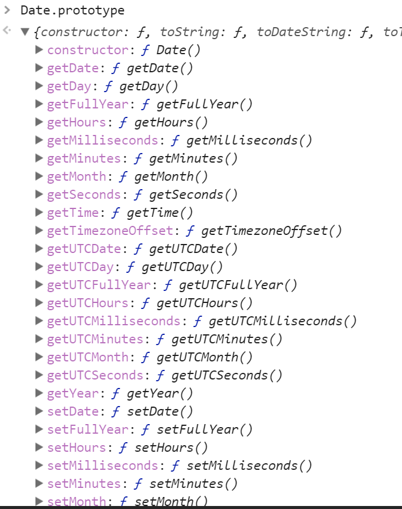
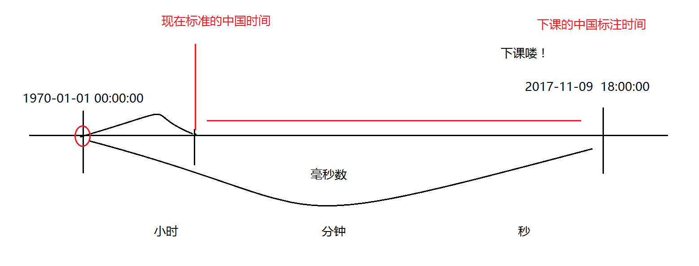
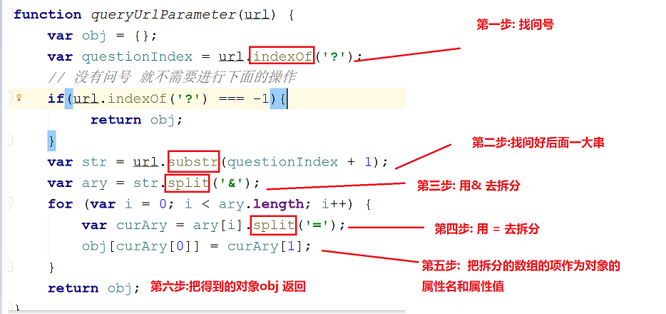
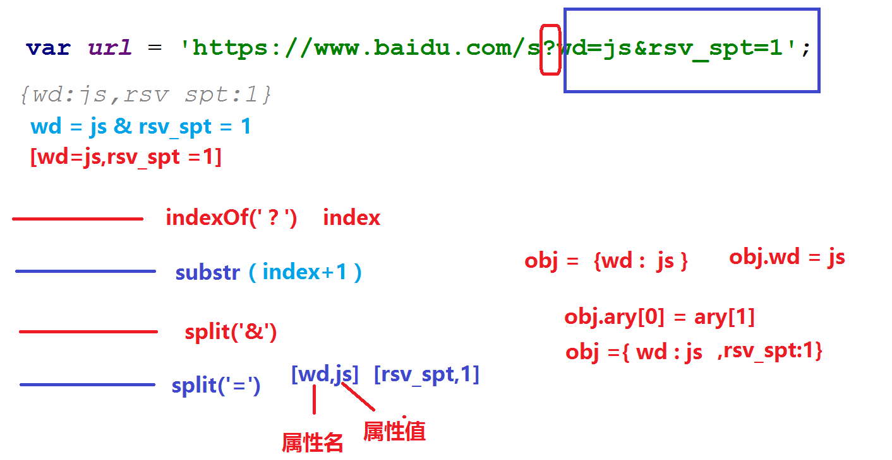
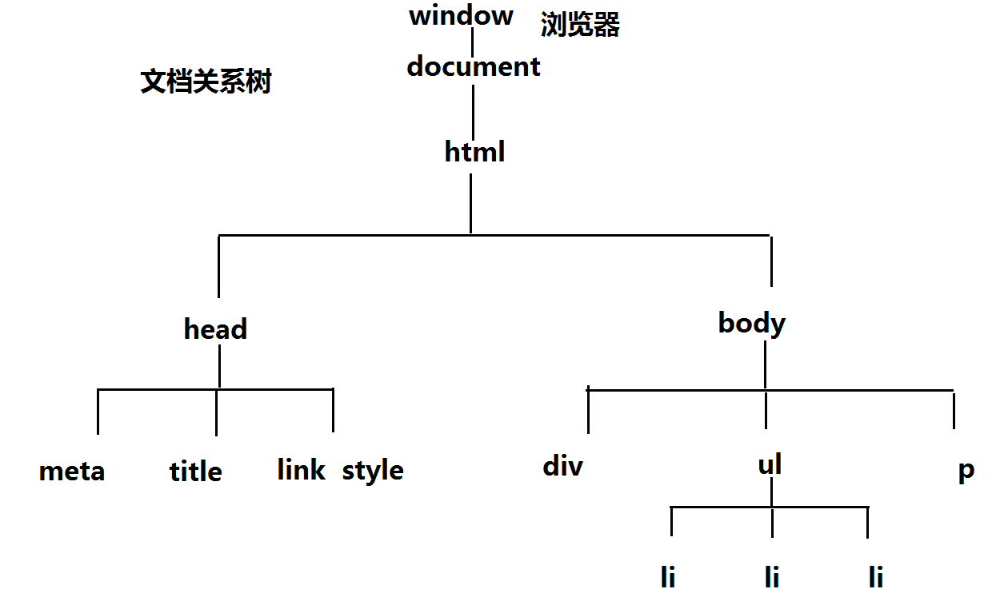
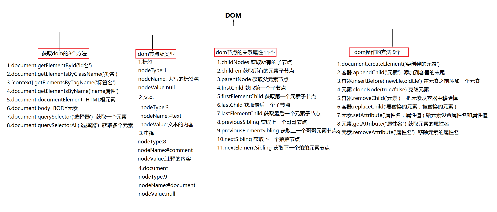

[TOC]
####数据类型、数据类型检测方法、数据类型的转换、引用数据类型的方法

@(JavaScript)

#####基本类型
#####`1.number数据类型`
>包括整数 (正整数/负整数 ) ，小数 ，  0，  NaN
>NaN：is not  number 不是一个数
>isNaN：（is not  number 不是一个数）=>判读命题:"不是一个数"这个命题是否成立
>成立：不是一个数=> true
>不成立： 是一个数 => false
>Number()
>parseFloat()
>parseInt()
>
>查找机制：
>number查找机制：从左往右依次查找，把有效纯数字直接查找输出，如果碰到只要有一个非纯数字的，则会停止查找，就算这个非纯数字后面还有数字，我们也不管；就返回结果就是NaN（not a number）；（他比较霸道）、
>返回结果：数字 或者 NaN
> `特殊情况： `
>                    `Number(null)//  0 `
>                    `Number(true) // 1`
>                    `Number(false) // 0`
>                    `Number('') // 0`     
>                    `Number([])// 0  空数组`
>                    `Number({})// 0`
>                    `isNaN(null) // false`
>                    `isNaN(true) // false`
>如何判断“是一个纯数字”还是“不是一个纯数字”：
>就是看里面有没有纯数字之外的字符(比如字母)，只要有非纯数字的字母就是NaN
>
>isNaN:返回的结果 要么是true  要么是false
>NaN：返回结果  要么是数字 要么是 NaN
>
>`.parseFloat`
>查找机制：从左往右依次查找，   把查找到的有效数字提取出来返回，把后面的非有效纯数字忽略掉，如果提取出来的数字带小数点，最后连小数点也一起输出；相对来说，他没有number那么霸道；
>返回结果：数字（有小数点 也一同输出）或者NaN'
>parseInt 的查找机制和parseFloat的查找机制一样，区别在于他不带小数点，会把小数点直接忽略掉；输出一个整数
>NaN 和任何数相比较都不相等 包括他自己本身
>NaN==NaN =>false
>
>思考题：
>```
Number('12px')// NaN
parseFloat('12.5px')//12.5
parseInt('12.5px_12')//12
Number（null）//0
Number (undefined)//NaN
NaN==NaN//false
isNaN('px12')//true
isNaN(null)//null=>0=>是有效数字=>=>假
>```


#####>`2.布尔数据类型Boolean`
>取值：true真、false假
>`特殊情况：只有 0、null、undefined、' '、NaN`只有这5个为假，其余都为真
>
> boolean
> !  表示取反
> ！！ 表示取反在取反，相当于恢复正常情况 调用Boolean方法
> 基本数据类型在判断Boolean值得时候，就是看有没有那5个值得特殊情况，只要有0，null，‘ ’， undefined，NaN；就是false，没有就是true

#####>` 3.string 字符串数据类型`
 >含义：用单引号或者双引号包起来的都叫字符串
 >str1=‘13’+12；//字符串拼接 1312
 >str2= 13+12；// 数学的加法运算 25
 >加号(+)连接符：
 >
 >`字符串在加号(+) 的去前面和后面得出的结果是有区别的`
 >
 >1.如果连接的是两个数字，则是数字运算里面的加法运算；
 >2.如果连接是其中一个是字符串类型的值，则是字符串拼接；
 
##### >  ` Null和undefined数据类型的区别`
 >null 是一个空指针对象，但是他不是对象数据类型的值，而是划分到基本数据类型里面；
 >undefined：未定义；声明一个变量名，如果只声明，未定义（没有给变量名赋值）返回的结果就为undefined
 >举例    耿大爷的男朋友  undefined
 >            耿大爷的女朋友   null
 >null 表示现在没有 以后可能会有  意料之中的没有
 >underfined 现在没有  以后可能会有可能没有   意料之外的没有 但是不在计划之内


#####object对象数据类型
字面量创建对象
var obj ={ name：‘珠峰’，}
实例创建对象的方法
var obj = new object( );


 > 语法：以属性名：属性值(键key：值value)的形式存在，多组键值对之间用逗号隔开；
 > 获取对象的属性名有几种方法？查
 > 1.对象 . 属性名
 > 2.对象[ '属性名']
 > 特殊情况：如果对象有一个属性名为数字，只能用第二种方法去获取属性对象，对象[数字的属性名]；//遇到数字属性名不用引号
 > 
 > 对象的增、改
 > =>1.如果对象里面已经存在某个属性名；我们在写对象.属性名，这个表示修改；会把之前已经存在的属性名对应的属性值给替换掉
 > =>2.如果对象里面不存在某个属性名；我们在写对象.属性名，这个表示给这个对象增加一个属性名；
 > => 3.如果有数字的属性名，在控制台中，显示在最前面，后面按照对象的顺序依次排列
 > 总结： 有=>修改  没有=> 增加
 > 
 > 
 > `【删除】`
 > 1.假删除（不是真正意义上的删除）
 > 对象[‘属性名’]/ 对象.属性名(数字：对象[数字])=null
 > 这种情况属性名还是存在  只是属性值变成空指针对象 null
 > 2.真删除（真正意义上的删除）detele
 > detele(对象['属性名'] /对象 . 属性名)
 > 这种情况属性名和属性值 同时被删掉
 > ```
 > console.log(obj[age]);//age变量名；获取对象的属性名只有两种方法，
 >```
```
   //    obj.name  按tab键自动生成下面的代码
    //    console.log(obj.name); //zhufeng
    //    console.log(obj['name']); //zhufeng
    //    console.log(obj['age']); //9
    //    console.log(obj[0]); //'公保'

    obj.height = '190cm';
    console.log(obj);
    //{0: "公保", name: "zhufeng", age: 9, height: "190cm"}
    
    obj.name = "李凯";
    console.log(obj);
    //{0: "公保", name: "李凯", age: 9, height: "190cm"}
    
    obj[0] = null;
    console.log(obj); //{0: null, name: "李凯", age: 9, height: "190cm"}
    
    delete(obj[0]);
    console.log(obj); // {name: "李凯", age: 9, height: "190cm"}
```
####`思考题`
>    `//obj[age] 和 obj['age'] 的区别?`
    /*分析思路:
    * 获取属性名的两种方法:
    * 1.obj.属性名
    * 2.obj['属性名']
```
  var age = 'name';
    var obj = {
        name:'候红伟',
        age:18
    };
    console.log(obj.age); // 18
    console.log(obj['age']);//18
    console.log(obj[age]);// age变量名 => 我们说过变量名是没有任何的实际意义 它代表的是变量等号后面的值  => obj['name'] => 这种形式才是我们获取对象的属性名的第二种方法 =>obj.name => '候红伟'
    /*
    * 注意点:obj后面中括号 加引号是获取obj属性名的第二种方法
    *       不加引号代表的是变量名 但是变量名没有实际的意义,它代表的是变量名            后面存的值
    * */
    //var zlh = "朱立辉"
    
```
####`思考题进阶`

>var sex = 'man'; >  var obj = {
        man: '候红伟',
        sex: 'woman',
        0: 1
    };
    console.log(obj.sex);//woman
    console.log(obj[0]);//1
    obj.sex = 'man'; //=>obj 里面的sex属性名代表的属性值修改为man
    console.log(obj['sex']);//man
    console.log(obj[sex]);// =>obj[sex变量名] =>obj['man'] =>obj.man =>候红伟
    /*分析思路:
    * 首先找我们熟悉的获取属性名的方法,只有obj.属性名或者obj['属性名']这两种写法才是获取属性名的方法
    * 后面obj['属性名']如果属性名没有引号 属性名就变成变量 但是变量又没有实际的意义,代表的是变量等号后面存的值
###`考试题`
>值类型和引用数据类型的本质区别？
>值类型 = number  string  Boolean  null  undefined  
>引用数据类型：对象数据类型（Object  Array   /^$/   Math   Data ）和函数数据类型 Function
>本质区别：
>基本数据类型(值类型)按值操作    一个变量值得改变不会影响另一个变量值的改变
>引用数据类型  是按引用空间地址去操作  只想的是一个空间地址

``` 基本数据类型
    var num1 = 12; //num1=12
    num2 = num1; //num2=12
    num2 = 13; //num2 =13
    console.log(num1);//12
    console.log(num2);//13

    // 引用(对象)数据类型
    var obj1 = {
        name: '公保'
    };
    obj2 = obj1;
    obj2.name = '宫保鸡丁';
    console.log(obj1);
    console.log(obj2);
```


#####检测数据类型的方法
 
 > 数据类型：基本数据类型
 >                    引用数据类型
 >   【检测数据类型的方法】
 >   =>ESCMAScript 是一门松散的语言 变量可以存储多种数据类型的值
 >   但是数据类型有很多 但是我们如何去区分呢？
 >  需要用检测数据类型的方法去区分，所以引申出这样一个知识点
 >    =>   检测数据类型的方法？
 >    1.typeof  检测数据类型的运算符
 >    => 返回的结果： 是一个引号  引号里面放的是对应的数据类型
 >     * 比如:'number' 'string' 'boolean'  'undefined'  'object'
     * 特殊:typeof null =>'object' (null空指针对象)
     *=> 弊端(局限性):对象用typeof去检测 返回的结果是object
     *  但是null用typeof去检测 返回的结果也是object 所以用typeof去检测并不能去精准的区分到底是null还是object对象
     *
     *  2.instanceof 检测一个实例是否属于这个类
     *  3.constructor:检测当前实例所属类的构造器的属性
     ·  4.Object.prototype.toString.call():检测数据值所属类的方法
     
     
#####`思考题(腾讯面试题)`
    
    console.log(typeof typeof typeof []);
    // => typeof []  =>'object'
    // => typeof 'object' =>'string'
    // => typeof 'string' =>'string'
    //=>  typeof 'string'
    //=> 规律:typeof超过2个以上 最后的结果都是'string'

    //    null   null数据类型
    //    ""     字符串数据类型 => 空字符
    //    0      number数据类型

    console.log(typeof 0); //'number'
    console.log(typeof '1');//'string'
    console.log(typeof true);//'boolean'
    console.log(typeof null);//'object'
    console.log(typeof undefined);//'undefined'
    var obj = {name: '李凯'};
    console.log(typeof obj);
    console.log(obj instanceof Object); //true
#####重要    数据类型的直接互相转换规则：黄金法则

> 数据类型之间相互转换的黄金法则:
 1.对象与对象的比较 永远不相等 (比较的是不同的内存地址)
 2.对象与字符串的比较
              => 对象 先要调用 toString方法 转换为字符串
             => 字符串与字符串的比较
 3.对象和布尔数据类型的比较(最后都转换为相同的数据类型（number数据类型）进行比较)
            => 对象 先要调用 toString方法 转换为字符串 再调用Number方法 转换为数字
            =>布尔 直接调用Number方法 转换为数字
 4.对象和数字的比较(最后都转换为相同的数据类型（number数据类型）进行比较)
           => 对象 先要调用 toString方法 转换为字符串 再调用Number方法 转换为数字
5.布尔 => 数字
          => 布尔 调用Number方法直接转换为数字
6.数字 => 字符串
          => 字符串 调用Number方法直接转换为数字
7.null == undefined true
          null === undefined false（三个是严格比较 需要数据类型也相当）
8.NaN 和任何数据类型都不相等，包括它本身
      *  总结:最后其实都调用了Number转换为数字 进行比较
      *  对象与字符串比较的时候 需要把对象转换为字符串 然后再跟字符串进行比较
       `


    /*1. 对象   =>  对象*/
    console.log([12, 13] == {name: 'zhufeng'}); //false

    /*2. 对象   =>  字符串 */
    console.log([12, 13] == '1213');
    // toString([12,13]) => "[object Undefined]"
    // Number("[object Undefined]") => NaN
    // Number('1213') => 1213
    // NaN == 1213
    // false  (NaN和任何的数相比较都不相等 包括它自己本身)

    /*3. 对象   =>  布尔 */
    console.log([12, 13] == true);
    //toString([12,13]) => "[object Undefined]"
    //Number("[object Undefined]") => NaN
    //Number(true) =>  1
    //NaN == 1
    //false

    /*4. 对象   =>  数字 */
    console.log([12, 13] == 12);
    //toString([12,13]) => "[object Undefined]"
    //Number("[object Undefined]") => NaN
    //NaN == 12
    //false

    /*5. 布尔   =>  数字 */
    console.log(true == 12);
    //true => Number(true) =>1
    //1==12
    //false

    //console.log(null == undefined);

    /* 数字 =  布尔*/
    console.log(parseFloat('12px12') == true);
    //=>parseFloat('12px12')  12
    //true =>Number(true) =>1
    //12 == 1
    //false
####数组
数组每一项都有与之对应的索引：从0开始，一次加1；length是代表数组有多少个数组成员
#####数组的方法：处理数组方法
数组方法的作用
数组的方法：方法是一个函数，具有一定功能；
处理数组
1.pop:
     1.删除数组最后一项
    2.不需要传参数
    3.原有数组发生变化
    4.方法的返回值是删除的那一项
    ary.pop();

2.push:
    1.给数组末尾添加一项
    2.添加最后一项的值，添加多项，参数用逗号隔开
    3.原有数组发生变化
    4.返回值是新增数组的length 长度(length属性值)
```
   ary[ary.length]=100;//在后面添加一个值
```

3.shift:
    1.删除数组的第一项
    2.不需要传参数
    3.原有数组发生变化
    4.返回值是删除数组第一项的值

4.unshift:
    1.给数组开头新增一项
    2.需要传入新增的那一项
    3.原有数组发生变化
    4.返回值新增一项之后数组成员的个数(length 长度)

5.slice(m,n)//m,n代表索引
	1.数组的截取，从从索引m开始，截取到n，不包括索引n
	2.参数：
	两个参数(m,n):m>n
	m为负数，不小于总长度时，（负数+总长度=m）
	当m为负数，小于总长度就从索引0开始截取
	一个参数slice(m):从索引m截取到末尾；没有参数，`克隆或复制`一次数组
	3.原有数组不发生改变
	4.返回值是截取的数组结果
```
console.log(ary.slice(1,3))
```


	
6.splice()
	1.参数
		1.splice(m,n)；两个参数: 从索引m开始，截取n项(返回值)；原有数组删除n项
		2.splice(m,x,n);三个参数：从索引m开始，删除x项，用n替换
		3.splice(m,0,n);新增一项
	2.原有数组发生变化
	3.删除那几项以数组形式返回

7.reverse 
	1. 让数组倒过来排序
	2. 不需要参数
	3. 原有数组发生变化
	4. 倒过来排序的数组

8.sort  
	1.只能把个位数从小到大排序，只能排10以内的
	2.参数：可以处理10以上的
```
ary.sort(function(a,b){return a-b})从小到大
ary.sort(function(a,b){return b-a})从大到小
```
   3.原有数组发生改变
   4.返回排序好的数组
   
9.join
	1.按照特定的字符，把数组每一项链接起来，并以字符串形式返回
	2.需要参数(特殊字符)
	3.原有数组不变
	4.返回字符串的结果
	
10.concat
	1.`克隆`数组
	2.参数：
		没有参数：相当于复制
		有参数：可以是数组或用逗号隔开
		把参数克隆一份放进原有数组里
	3.原有数组不变
	4.返回一个新的数组
	
11.indexOf：判断当前数组第一次出现的索引位置
	1.检测当前数组项第一次出现的索引位置
	2.参数：要检测的那一项
	3.原有数组不变
	4.返回第一次上出现的索引，没出现返回-1
	
12.lastIndexOf
	1.检测当前数组项最后一次出现的索引位置
	2.要检测的那一项
	3.原有数组不变
	4.返回最后一次出现的索引(如果不存在返回-1)
	
13.forEach/map：遍历(循环，查找)数组\
	1.遍历循环数组
	2.需要参数
		forEach只有两个参数（数组项，索引）；    
		map有三个参数（数组项，索引，数组长度）
	3.原有数组不变
	4.foeEach没有返回值
		map 有返回值，返回数组
```
ary.forEach(function(item,index)){
console.log(item)//数组的每一项
console.log(index)
}
```


	


*/


####Math数学函数
>我们叫math为数学函数，但是用typeof去检测为“object”，属于引用数据类型
>typeof Math   "object"
> console.dir(Math) 
> 1.abs：取绝对值
> 
> 2.ceil：向上取整
> 
> 3.floor：向下取整
> 
> 4.round：四舍五入（正数包括5，在负数里面不包括5，不会五入，必须大于5才可以往前入  哪怕知识大一点点点点）
> 
> 5.random：取[0~1)的随机数，包括0,取不到1
> 
> Math.round(Math.random())：取随机整数
> 
> 获取n-m之间的随机整数(计算公式)
> Math.round(Math.rando()*(m-n)+n) //n~m之间的随机整数
> Math.floor((Math.rando()*((m+1)-n)+n))
> 
> 取随机数的一个值：（高程3 135页  物范围）
> 值=round.floor(Math.random()*可能值得总数+第一个可能的值)
> 
> 6.min 最小值
> 
> 7.max 最大值
> 
>8.PI     获取圆周率
>
> 9.pow (m,n)  取m的n次方；值得多少次幂（参数必须是两位）
> 
> 10.sqrt   开平方


####string字符串  str.方法名(索引)
>有一个叫length的长度
console.log(String.prototype)
方法在dir
>1. charAt 获取索引对应的字符 ：charAt方法的值为负数 ==》 返回 “”空字符串
```
var str="hello world!"
str.charAt(-1) ==> ""  
str.charAt(str.length)  ==>"" //  字符串的长度大于字符串中最后一个字符串的索引值
str.charAt(str.length-1)  ==> !   //最后一个字符的索引值
```
>2. charCodeAt    获取对应的字符unicode编码（ISCII码值）
>```
>str.charCodeAt()
>```
>3. 
 >  fromCharCode()    把unicode编码转换为对应的字符
 >  ```
 >  str.fromCharCode() 
 >  ```
>4. concat    字符串拼接 可放多个字符串  用逗号隔开进行拼接
```
  var str="hello world!"
>   var str1='zhu feng'  == >"hello world!zhu feng"
>   var str2='fighting'
>    str.concat(str,str2) ===>"hello world!hello   world!fighting"
>   str.concat(str1,str2)  ===>"hello world!zhu fengfighting"
```
.fixed    <tt> </tt>//87
>5. indexOf   字符第一次出现位置的索引  可以用来检测字符是否存在，不存在-1；从左往右检索
>6. lastIndexOf   字符最后一次出现位置的索引  可以用来检测字符是否存在，不存在-1；从左往右检索
>7. match   //要捕获的字符 正则捕获
>```
>
>```
>8. replace  替换字符  但是就只替换一下次，所以只能一个个替换 ；可以借助正则实现实现整体替换(/o/g,zhufeng)  ：将o全部替换成zhufeng
>```
>str.replace('o','珠峰') =>welc珠峰me to zhufeng    //每次只替换一个
>str.replace((/o/g,zhufeng)//整体全部替换
>```
>9. toUpperCase   转换成大写
>10. toLowerCase  转换成小写
>11. trim  去掉左右两边的空格
>12. trimLeft  去掉左边空格
>13. trimright  去掉右边的空格
>>14. substr(索引  字符个数)
>15. substring：两个参数索引都不支持为负数，如果是负数，会被强制转换为0，从小到大重新排列索引值
>16. slice： 支持2个参数同时都为负数 ，第一个参数为负数   需要第二个参数也为负数  ； 支持第二个参数为负数  负数的索引是  (  负数  +  字符总长度   得到一个正值得索引)(  负数  +  字符总长度    得到一个正值得索引)
>slice和substring 的参数都表示索引 ；
>第一个参数不写，只写第二个参数，截取到末尾
>```
>【第一个参数的情况】
>substring  不支持第一个参数为负数  如果为负数 会转换为0 
>slice  第一个参数为负数   需要第二个参数也为负数  (  负数  +  字符总长度    得到一个正值得索引)
>【第二个参数的情况】
>substring  不支持第二个参数为负数  如果为负数 会转换为0  
>slice  支持第二个参数为负数  负数的索引是  (  负数  +  字符总长度   得到一个正值得索引)
>substring  不支持负数作为索引 如果索引是负数都被强制转换为0
>slice 支持2个参数同时都为负数 （负数索引  +  字符总长度 = 正数的索引）
>```
>17.str.split()   分割字符，拆分 ===》返回结果是一个数组
>```
>str.split()
>```
####Date时间



```javascript
1.new data()        获取中国标准时间
2.getFullYear       获取年(四位整数)
3.getMonth          获取月 0~11  对应的是1-12月份
4.getDate           获取日  
5.getDay            获取星期  0~6  对应的是周日-周六
6.getHours          获取时
7.getMinutes        获取分
8.getseconds        获取秒
9.getMilliseconds   获取毫秒
10.getTime()        距离1970-01-01 00:00:00   毫秒数


```
###定时器


```javascript
window.setInterval(function(){},interval)
//window.setInterval(函数，时间)
//每隔一段时间执行函数，不停的执行
//表示每隔interval这个时间都执行一次
window.setTime(function(){},interval)  只执行一次就停止
//  window.setTimeout(函数,时间)  等待一段时间 ，执行函数
window.clearInterval()清除定时器
window.clearTimer() 清除定时器

```
### 倒计时抢购


```
function computedTime() {
    var time = new Date(),
        startTime = time.getTime(),
        strTime = new Date('2017/11/9 18:12:00'),
        endTime = strTime.getTime();
    var timeSpan = document.getElementById('timeSpan');

    areaTime = endTime - startTime; // 我们下课的时间距离1970-01-01 00:00:00 之间的毫秒差

    if (endTime - startTime <= 0) {
        window.clearInterval(timer);
        timeSpan.innerHTML = '开抢啦！！';
        return;
    }

    hours = Math.floor(areaTime / (1000 * 60 * 60));  //获取小时对应的毫秒数
    areaTime -= hours * 60 * 60 * 1000;  //除掉小时剩下的毫秒数

    minutes = Math.floor(areaTime / (1000 * 60)); //获取分钟对应的毫秒数
    areaTime -= minutes * 60 * 1000; //除掉分钟剩下的毫秒数

    second = Math.floor(areaTime / 1000); //获取秒对应的毫秒数
    areaTime -= second * 1000;


    timeSpan.innerHTML = hours + '时' + minutes + '分' + second + '秒';
}
computedTime();
var timer = window.setInterval(function () {
    computedTime();
}, 1000);
```


###域名分割



```
var url = 'https://www.baidu.com/s?wd=js'
function queryUrlParameter(url) {
    var obj = {};
    var questionIndex = url.indexOf('?');
    // 没有问号 就不需要进行下面的操作
    if(url.indexOf('?') === -1){
         return obj;
    }
    var str = url.substr(questionIndex + 1);
    var ary = str.split('&');
    for (var i = 0; i < ary.length; i++) {
        var curAry = ary[i].split('=');
        obj[curAry[0]] = curAry[1];
    }
    return obj;
}
queryUrlParameter(url);
```


#### DOM （document object model）文档对象模型
#####  获取dom元素的8个方法

`1.document.getElementById('id名')` 
> 通过id名来获取元素
> 在ie6 /7 会把input的name属性当成id名去处理( 在实际项目中要注意:input的name名称不要和id名重复)
> 可以直接写id名来获取元素   比如 tab.style.background='red'  (不推荐 )
> id 唯一  ，它的上下文（context）只能是document

`2.document.getElementsByTagName('标签名')`
> 通过标签名来获取元素
> 获取的结果是一个类数组集合 (索引是以0开始 而且依次递增 还有叫length长度的属性)
> 要使用类数组中的项  必须要通过索引去获取; 类数组里即使只有一项 我们也要通过索引去获取  oLis[0]
```javascript
var oLis = document.getElementsByTagName('li');
  oLis.style.background = 'blue';  // 26 Uncaught TypeError: Cannot set property 'background' of undefined

oLis[1].style.background = 'red' 
```
`3.document.getElementsByClassName('class类名')`
> 获取的结果也是一个类数组集合  就是只有一项  也必须通过索引去获取

`4.document.getElementsByName('元素的name属性值')`
>通过name属性来获取元素
> 一般用在表单元素上
```
<label><input type="radio" name="sex"> 女</label>
<label><input type="radio" name="sex"> 男</label>

var oIpts = document.getElementsByName('sex');
```

`5.document.documentElement  获取的是html根元素`
`6.document.body 获取的是body元素`
```javascript
// 获取页面的宽度和高度
var width = document.documentElement.clientWidth ||document.body.clientWidth;
var height = document.documentElement.clientHeight || document.body.clientHeight;
```

`7.document.querySelector('选择器') 获取一个元素`
`8.document.querySelectorAll('选择器') 获取一组元素`
>ID是#  Class是 .
> querySelector 和  querySelectorAll 里面放的选择器遵循css选择器的规范   
> querySelector('.tab')   querySelectorAll（'#tab  li'） 
> 主要用在移动端 


####DOM节点及类型



文档结构关系中所有内容都成为节点 
标签   文字   内容   注释   空格    换行符   都是节点

>1.标签
>>nodeType：1
>nodeName：大写的标签名
>nodeValue： null

>2.文本
>>nodeType：3
>nodeName：#Text
>nodeValue： 文本内容

>3.注释
>>nodeType：8
>nodeName：#comment
>nodeValue： 注释的内容

>4.document
>>nodeType：9
>nodeName：#document
>nodeValue： null

####DOM节点关系
- childNodes 获取元素的所有节点 （包括空格  标签 注释...）
- children 获取元素的所有标签节点（不包括空格  标签 注释...）
     注意：IE6~8与标准浏览器返回的结果有区别（IE6~8中会把注释节点作为元素节点获取到）
- parentNode 获取当前元素的父节点（元素对象）
- firstChild 获取的是当前元素所有子节点中的第一个子节点 （子节点有可能不是标签  而是注释 空格 文本 等）
- lastChild 获取的是当前元素所有子节点的最后一个子节点 （子节点有可能不是标签  而是注释 空格 文本 等）
	 firstElementChild 、lastElementChild（IE6~8中不兼容）
- firstElementChild  获取的是当前元素的所有子节点元素的第一个标签子节点(只有标签)
-   lastElementChild  获取的是元素的第一个标签子节点(只有标签)
- previousSibling获取当前节点的上一个哥哥节点（子节点有可能不是元素节点（标签）  而是注释 空格 文本 等）
- nextSibling 获取的是当前节点的下一个弟弟节点（子节点有可能不是标签  而是注释 空格 文本 等）
	  previousElementSibling 、nextElementSibling（IE6~8中不兼容）
- previousElementSibling  获取的是元素的上一个哥哥标签子节点(只有标签)
- nextElementSibling  获取的是元素的下一个弟弟标签子节点(只有标签)


####Dom元素的操作（创建、添加、克隆、删除、查找）
>【1.创建——createElement】
>document.createElement('要创建的元素')    //创建一个元素
>
>【2.添加在容器的末尾—— appendChild 】
>容器.appendChild('元素')            //往容器里面添加内容（容器的后面）
>
>【添加在元素之前—— insertBerore】
>3.容器.insertBerore(‘newEle，oldEle’)         //在元素之前添加
>
>【克隆——cloneNode(true/false) 】
>4.元素. cloneNode() 把元素克隆一份
>-括号里不写参数 只克隆标签
>-cloneNode(true)  //深度克隆 把标签及标签里面的所有内容都克隆一份
>
>【移除——removeChild】
>5.容器.document.body.removeChild('要移除的元素')// 把元素从容器中移除掉
>
>【6.替换——replaceChild】
>容器.replaceChild('替换的元素，要被替换掉的元素')
>
>【7.设置自定义属性】
>.元素.setAttribute('属性名，属性值')  //给元素设置属性名和属性值
>
>【 8.获取自定义属性—— getAttribute】
>元素.getAttribute('属性名') //获取元素的属性名
>
>【9.移除自定义属性】
>元素.removeAttribute('属性名')  //移除元素的属性名
> 
```
javascript
<script>
  【创建 - createElement】
    var oDiv = document.createElement('div');  //动态创建一个div
    oDiv.id = 'div1';
    oDiv.innerHTML = '欢迎大家来到珠峰培训！';
    oDiv.style.fontSize = '60px';

    //【添加 - appendChild(在末尾添加)  insertBefore(在元素之前添加)】
    document.body.appendChild(oDiv);  //把新创建的div 添加到body标签里面
    var oDiv2 = document.getElementById('div2');
    document.body.insertBefore(oDiv,oDiv2); //表示把我们新创建的div添加页面结构已经存在的标签的前面

    //【克隆 cloneNode (true/false)】
    var clo = oDiv.cloneNode(true);  //把div深度克隆一份
    document.body.appendChild(clo); //把克隆的元素添加到页面中

    //【移除 removeChild】
    document.body.removeChild(clo);  //移除元素

    //【替换 replaceChild】
    var oDiv3 = document.createElement('div');
    oDiv3.id = 'div3';
    oDiv3.style.width = '200px';
    oDiv3.style.height = '200px';
    oDiv3.style.background = 'blue';
    document.body.replaceChild(oDiv3,oDiv2);

    //【添加属性 setAttribute】
    oDiv3.setAttribute('zhufeng','珠峰培训');
    oDiv3.setAttribute('gengdada','耿大大');

    //【获取属性 getAttribute】
    console.log(oDiv3.getAttribute('gengdada')); //耿大大

    // 【移除属性 removeAttribute】
    oDiv3.removeAttribute('zhufeng');
</script>
```

